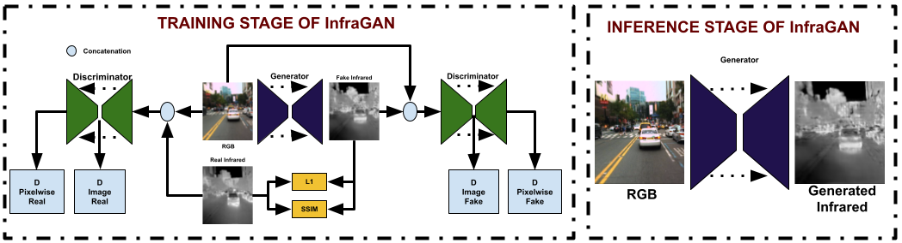

# InfraGAN 


The code is based on the PyTorch [implementation](https://github.com/junyanz/pytorch-CycleGAN-and-pix2pix) of the pix2pix, CycleGAN.
and also [ThermalGAN](https://github.com/vlkniaz/ThermalGAN)
## Prerequisites
- Linux or macOS
- Python 2 or 3
- CPU or NVIDIA GPU + CUDA CuDNN

## Getting Started
### Installation
- Clone this repo:
```bash
git clone https://github.com/makifozkanoglu/InfraGAN
```
- Install dependencies by using the command below
```bash
pip install -r requirements.txt
```
- Alternatively, you can install required packages one by one: torch, torchvision, visdom and dominate. See below
- Install PyTorch and dependencies from http://pytorch.org
- Install Torch vision from the source.
```bash
pip install torch torchvision
```
- Install python libraries [visdom](https://github.com/facebookresearch/visdom) and [dominate](https://github.com/Knio/dominate).
```bash
pip install visdom
pip install dominate
```


### InfraGAN train/test on VEDAI dataset
- Download a VEDAI dataset from:

```bash
https://downloads.greyc.fr/vedai/
```
- You should split train and test set as follows. We first create test dataset by saving image pairs between 1000 and 1199 as shown below:

```
+VEDAI

+----test
+---------01000_co.png
+---------01000_ir.png
+---------01001_co.png
+---------01001_ir.png
...
+---------01199_co.png
+---------01199_ir.png
```
- 
```
+----train
+---------00000_co.png
+---------00000_ir.png
+---------00001_co.png
+---------00001_ir.png
...
+---------00999_co.png
+---------00999_ir.png
+---------01200_co.png
+---------01200_ir.png
...
+---------01271_co.png
+---------01271_ir.png
```
KAIST datasets folder structures should be as follows:
```
+----VIDEO_SETS
+---------set00
+---------set01
+---------set02
+---------set03
+---------set04
+---------set05
+---------set06
+---------set07
+---------set08
+---------set09
+---------set10
+---------set11

+----KAIST_TEXT_FILES
+---------test-all-01.txt
+---------test-all-20.txt
+---------test-day-01.txt
+---------test-day-20.txt
+---------test-night-01.txt
+---------test-night-20.txt
+---------train-all-02.txt
+---------train-all-04.txt
+---------train-all-20.txt
```

- Train a model after modifying --dataroot parameters into location of VEDAI dataset:
```
 python train.py --dataset_mode VEDAI --dataroot <DATASETFOLDER>/VEDAI --name infragan_vedai --model infragan --which_model_netG unet_512 --which_model_netD unetdiscriminator --which_direction AtoB --input_nc 3 --output_nc 1 --lambda_A 100  --no_lsgan --norm batch --pool_size 0 --loadSize 512 --fineSize 512 --gpu_ids 0 --nThreads 8 --batchSize 4
```
- To view training results and loss plots, run `python -m visdom.server` and click the URL http://localhost:8097. To see more intermediate results, check out `./checkpoints/thermal_gan_rel/web/index.html`
- Evaluate the model:
```
 python evaluate.py --dataset_mode VEDAI --dataroot <DATASETFOLDER>/VEDAI --name infragan_vedai --model infragan --which_model_netG unet_512  --which_direction AtoB --input_nc 3 --output_nc 1   --norm batch  --fineSize 512 --gpu_ids 0
```
- For KAIST dataset, 
You should indicate path for text file that you can read image paths.
```
 python train.py --dataset_mode KAIST --text_path <KAIST_TEXT_FILE_PATH>  --dataroot <DATASETFOLDER>/KAIST --name infragan_kaist --model infragan --which_model_netG unet_512 --which_model_netD unetdiscriminator --which_direction AtoB --input_nc 3 --output_nc 1 --lambda_A 100  --no_lsgan --norm batch --pool_size 0 --fineSize 512 --gpu_ids 0 --nThreads 8 --batchSize 4
 python evaluate.py --dataset_mode KAIST --text_path <KAIST_TEXT_FILE_PATH>  --dataroot <DATASETFOLDER>/KAIST --name infragan --model infragan --which_model_netG unet_512--which_direction AtoB --input_nc 3 --output_nc 1  --norm batch  --fineSize 512 --gpu_ids 0
```

```
 python train.py --dataset_mode FLIR --dataroot <DATASETFOLDER>/FLIR --name infragan_flir --model infragan --ngf 128 --which_model_netG unet_256 --which_model_netD unetdiscriminator --which_direction AtoB --input_nc 1 --output_nc 1 --lambda_A 100  --no_lsgan --norm batch --pool_size 0 --loadSize 256 --fineSize 256 --gpu_ids 0 --nThreads 8 --batchSize 8   --display_port 8097
 python evaluate.py --dataset_mode FLIR --dataroot <DATASETFOLDER>/FLIRR --name infragan_flir --model infragan --ngf 128 --which_model_netG unet_256 --which_model_netD unetdiscriminator --which_direction AtoB --input_nc 1 --output_nc 1 --norm batch --pool_size 0 --loadSize 256 --fineSize 256 --gpu_ids 0
``` 

 # Citation
```
@article{OZKANOGLU202269,
    title = {InfraGAN: A GAN architecture to transfer visible images to infrared domain},
    journal = {Pattern Recognition Letters},
    volume = {155},
    pages = {69-76},
    year = {2022},
    issn = {0167-8655},
    doi = {https://doi.org/10.1016/j.patrec.2022.01.026},
    url = {https://www.sciencedirect.com/science/article/pii/S0167865522000332},
    author = {Mehmet Akif Özkanoğlu and Sedat Ozer},
    keywords = {Domain transfer, GANs, Infrared image generation},
    abstract = {Utilizing both visible and infrared (IR) images in various deep learning based computer vision tasks has been a recent trend. Consequently, datasets having both visible and IR image pairs are desired in many applications. However, while large image datasets taken at the visible spectrum can be found in many domains, large IR-based datasets are not easily available in many domains. The lack of IR counterparts of the available visible image datasets limits existing deep algorithms to perform on IR images effectively. In this paper, to overcome with that challenge, we introduce a generative adversarial network (GAN) based solution and generate the IR equivalent of a given visible image by training our deep network to learn the relation between visible and IR modalities. In our proposed GAN architecture (InfraGAN), we introduce using structural similarity as an additional loss function. Furthermore, in our discriminator, we do not only consider the entire image being fake or real but also each pixel being fake or real. We evaluate our comparative results on three different datasets and report the state of the art results over five metrics when compared to Pix2Pix and ThermalGAN architectures from the literature. We report up to +16% better performance in Structural Similarity Index Measure (SSIM) over Pix2Pix and +8% better performance over ThermalGAN for VEDAI dataset. Further gains on different metrics and on different datasets are also reported in our experiments section.}
}
```
- Do not hesitate to contact with me via makifozkanoglu@gmail.com

